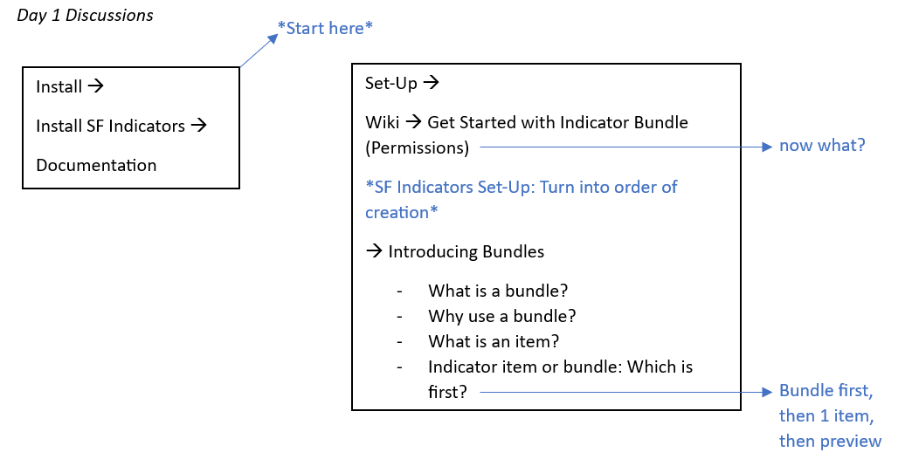
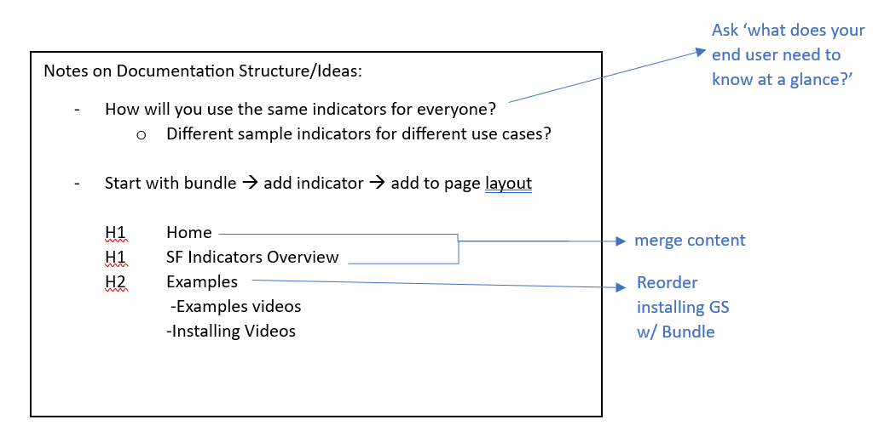
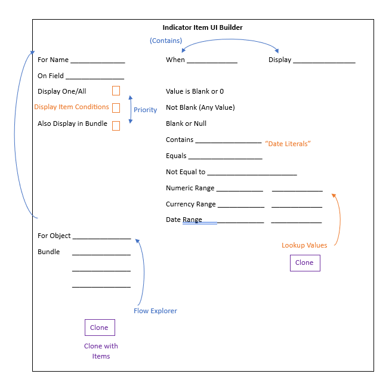

## Documentation

* We had a great discussion on the hurdles of installing and setting up Indicators and how we should improve the help documentation

{: width="590"}
{: width="590"}

* Excellent research for a technical issue 

{: width="330"}

## Sprint Notes:

[Salesforce Indicators Community Sprint.docx](../../images/sprints/Salesforce.Indicators.Community.Sprint4.docx)

Salesforce Indicators ❤️s and works really well with [DLRS](https://install.salesforce.org/products/dlrs/latest){:target="_blank"}

**Contributed By** Jennifer Cains
{: .contributed-by }
