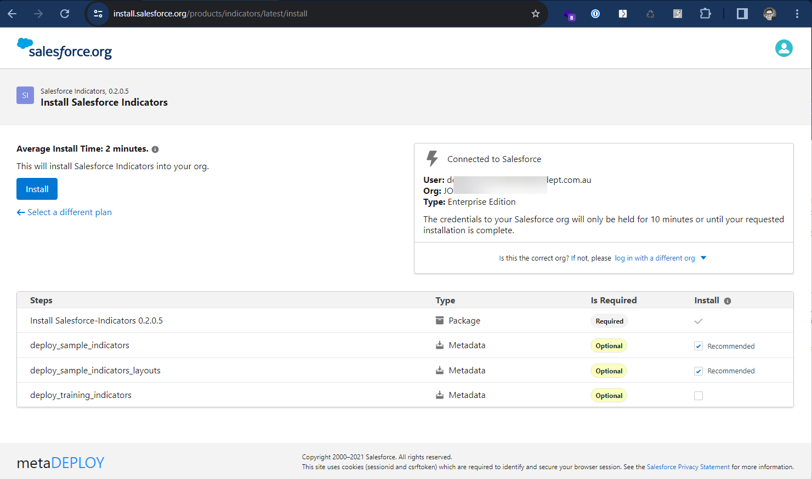
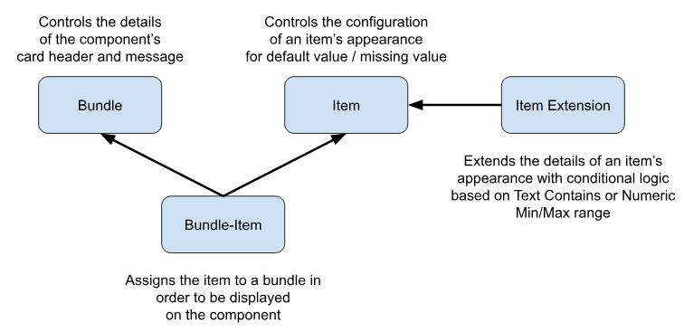

# Getting Started with Salesforce Indicators

Thank you for choosing Salesforce Indicators to enhance your Lightning Pages! This documentation will help you get started using the app.
After clicking **Get It Now** from the Salesforce Appexchange you will be taken to the Install Page. This uses the package installation tool used by all of the Salesforce Open Source Commons projects. 

## What to Install

* **Getting to Know Salesforce Indicators**: Install in a Trailhead Org or Scratch Org to learn how to use Salesforce Indicators. Include the Sample Indicators and Sample Layouts.
* **Ready for your Production Org**: We recommend Installing in sandbox and install the main Indicators latest release, then set up your Indicators in Sandbox and deploy to Production. (If you want to install directly in Production, that is fine too, but we recommend unchecking *Active* on the **Indicator Bundle** until the Bundle is all set up and ready for users). 

{: width="590"}

See [Install Salesforce Indicators](../install-salesforce-indicators/index.md) for the steps to Install.

## Structure of Salesforce Indicators

This is how the 4 Salesforce Indicators Custom Metadata Objects work together set up the Indicators.

{: width="590"}

* **Indicator Bundle**: Collection of Indicator Items for display on the Lightning Record Page. Multiple Bundles can be created for each Object, and conditionally displayed on the Lightning Record Page using [Visibility Rules](https://help.salesforce.com/s/articleView?id=sf.lightning_page_components_visibility.htm&type=5).
* **Indicator Item**: The setup to display an individual icon related to one field on the object. For instance, if you want to see a visual indiccator to see at a glance that the Account is Active, based on the custom *Account Status* field.
* **Indicator Bundle Item**: Displays the **Indicator Item** on the **Indicator Bundle**. This allows for one **Indicator Item** to be created and displayed on multiple **Indicator Bundles**.
* **Indicator Item Extension**: Allows more icons to be configured for one field that displays when the field has different values. Eg *Industry* = "Accounting" or *Industry* = "Communications".

{: .info-title}
>In Progress
>
>This page needs to be extended describing the [Sample Indicators] and [Training Indicators] and including screen shots and videos.

## Sample Use Cases for Salesforce Indicators

See [Recipes](../recipes/index.md) for ideas of different Indicators to use in your Org. 

## Use the Samples