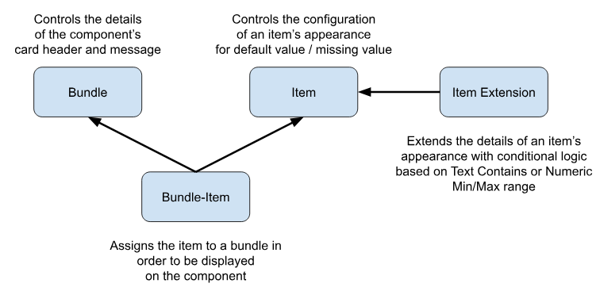

# Getting Started with Salesforce Indicators

See [Install Salesforce Indicators](../install-salesforce-indicators/index.md) if you have not already installed Salesforce Indicators.

{: .tip}
>More to Come!
>
>Salesforce Indicators at the moment is one Component - the Indicator Bundle. The Indicator Bundle requires setting up via Salesforce Custom Metadata Records. 
>We are currently working on a new UI which will make setup of the Indicator Bundle much easier, but it is still a while away. 
>We also have two new [Components](../components) planned - the Grid and the Panel. 
>See [Getting Involved with Salesforce Indicators](../getting-involved/) if you would like to help us build out these exiting new features.

## Structure of Salesforce Indicators

This is how the 4 Salesforce Indicators Custom Metadata Objects work together set up the Indicators.

{: width="590"}

* **Indicator Bundle**: Collection of Indicator Items for display on the Lightning Record Page. Multiple Bundles can be created for each Object, and conditionally displayed on the Lightning Record Page using [Component Visibility](https://help.salesforce.com/s/articleView?id=sf.lightning_page_components_visibility.htm&type=5){:target="_blank"}.
* **Indicator Item**: The setup to display an individual icon related to one field on the object. For instance, if you want to see a visual indiccator to see at a glance that the Account is Active, based on the custom *Account Status* field.
* **Indicator Bundle Item**: Displays the **Indicator Item** on the **Indicator Bundle**. This allows for one **Indicator Item** to be created and displayed on multiple **Indicator Bundles**.
* **Indicator Item Extension**: Allows more icons to be configured for one field that displays when the field has different values. Eg *Industry* = "Accounting" or *Industry* = "Communications".

## Sample Use Cases for Salesforce Indicators

See [Recipes](../recipes/index.md) for ideas of different Indicators to use in your Org. 

## Use the Samples

{: .info-title}
>In Progress
>
>This page needs to be extended describing the [Sample Indicators] and [Training Indicators] and including screen shots and videos.