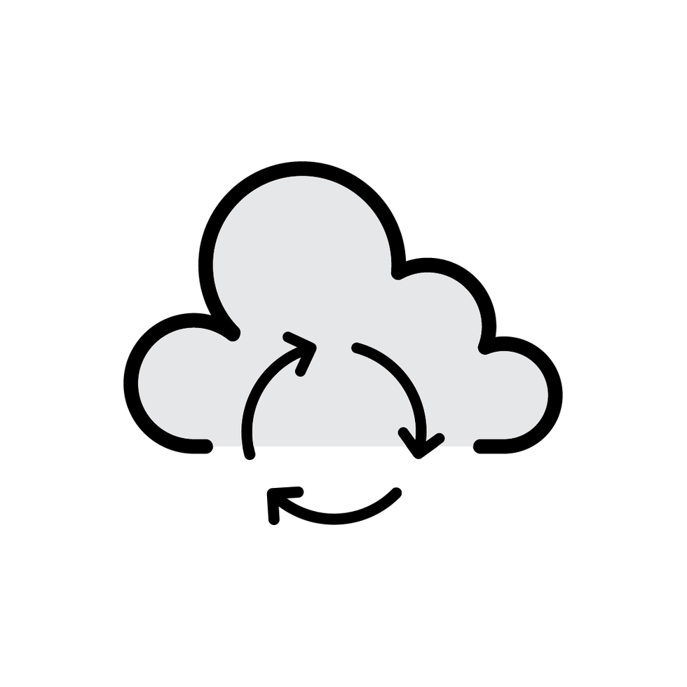
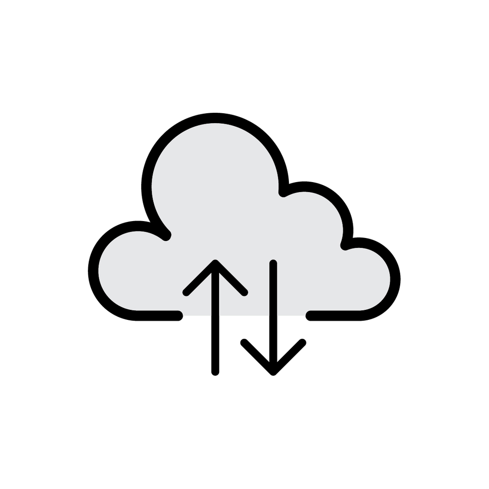

# Your Path to Success

Salesforce Indicators is configurable and no-code, so there's no single "next page" that's right for everyone.

{: .info-title}
>Why this page exists
>
>The rest of this site is reference documentation, grouped by component (Bundle, Item, Bundle Item, Extension): here's the field, here's what it does. That's necessary, but it can't tell you *when* to use a Badge instead of a Pill, or *why* three "Next Up" actions on one page is usually one too many.

The paths below fill that gap. Each is a short reading list that pulls from the existing docs in the order that makes sense for one goal, so you're not hopping from page to page. Not sure which fits? Path 1 is a safe default, and you can move on when you're ready.

## Choose Your Path

| | If you... | Start here |
|---|--------|---|
| {: width="300"} |**Have never used Salesforce Indicators before** and want to understand what it does and get the basics set up | [Path 1: New to Indicators](new-to-indicators.md) |
| {: width="300"} |**Already have Indicators running** and want to add new capabilities and understand all the nuances | [Path 2: Enhance your Indicators](enhance-your-indicators.md) |
| {: width="300"}  |**Already use Indicators** and want to help improve the product itself - code, docs, or ideas | [Path 3: Help Build Indicators](contribute-to-indicators.md) |

## The Guided Path, Step by Step

For each path, start with the first link, and then work your way through each link below.

| Step | Path 1: New to Indicators |Path 2: Enhance your Indicators | Path 3: Help Build Indicators |
|---|---|---|---|
| **First** | [Get to the Point](../philosophy/index.md) - why Salesforce Indicators exists | [Earning the Glance](../best-practices/index.md) - tips for what makes a good Indicator | [About Salesforce Indicators](../about/index.md) |
| **Next** | [Install Salesforce Indicators](../install-salesforce-indicators/index.md) | [Actions](../setup-salesforce-indicators/indicator-bundle-item/actions.md) - the one new feature people ask about most | [Get Ready to Contribute](../about/getting-ready-to-contribute.md) |
| **Then** | [Quick Start: your first Bundle](quick-start.md) | [Date Range Extensions](../setup-salesforce-indicators/item-extension.md) | [Contribute a Recipe](../recipes/recipe-template.md) - or a page on this site to improve |
| **Then** | [Set Up Salesforce Indicators](../setup-salesforce-indicators/index.md) - the full reference walkthrough | [Badges and Pills](../setup-salesforce-indicators/add-to-lightning-page/badges-and-pills.md) | [Preview and Share Recipes](../recipes/share.md) |
| **Later** | [View the Recipes](../recipes/index.md) - once the basics feel comfortable | [How Indicators is built](../technical-documentation/index.md) - check our Technical Documentation | [Join a Sprint](../about/sprints/index.md) - help us build Salesforce Indicators |

{: .note-title}
>TODO Notes
>
>- Really step through each page and see if it's actually working well?
