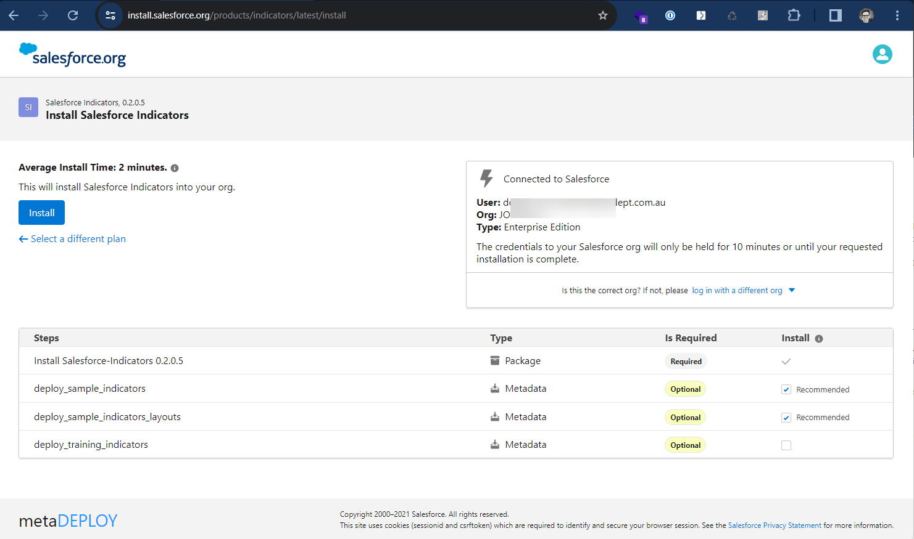
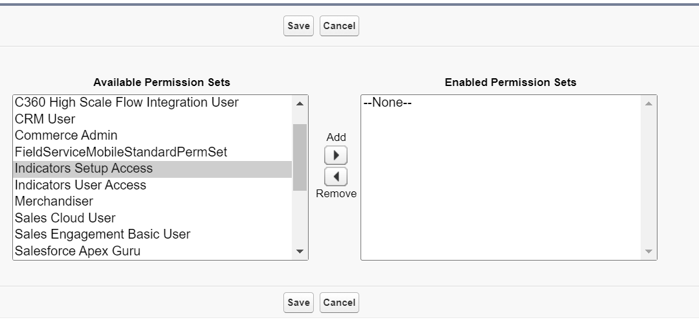
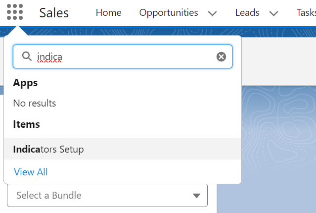

# Install Salesforce Indicators

Thank you for choosing Salesforce Indicators to enhance your Lightning Pages! This documentation will help you get started using the app.
After clicking **Get It Now** from the Salesforce Appexchange you will be taken to the Install Page. This uses the package installation tool used by all of the Salesforce Open Source Commons projects. 

[Salesforce Indicators Appexchange Page](https://appexchange.salesforce.com/appxListingDetail?listingId=192aeb3a-1476-4028-a25c-954d48560eba){: .noicon .btn .btn-green }{:target="_blank"}

* Click **Get It Now** on the Appexchange page.
* Install the latest version of the managed package from the [Install Page](https://install.salesforce.org/products/indicators/latest){:target="_blank"}. 
* See the [Release Notes](../release-notes) for the updates included in the latest version.

## Using Metadeploy to Install

Salesforce Indicators is a managed package and has been security reviewed by Salesforce. Installation, along with many other great Salesforce.org Open Source Commons applications, is done through Salesforce.org's [MetaDeploy installer](https://github.com/SFDO-Tooling/MetaDeploy){:target="_blank"}.

* On the Metadeploy page, log into your org. You will be asked to give the Metadeploy tool access to your org. This is necessary for installation.
* Click the *Install Salesforce Indicators - View Details* button.

    * **Getting to Know Salesforce Indicators**: For Developer Orgs, Trial Orgs, Scratch Orgs, or Trailhead Playground Orgs, we recommend to install Samples, Layouts and Tranining Bundles.
    * **Ready for your Production Org**: We recommend Installing in sandbox and install the main Indicators latest release, then set up your Indicators in Sandbox and deploy to Production. (If you want to install directly in Production, that is fine too, but we recommend unchecking *Active* on the **Indicator Bundle** until the Bundle is all set up and ready for users, or use [Visibility Rules](https://help.salesforce.com/s/articleView?id=sf.lightning_page_components_visibility.htm&type=5) to show the Bundles only to your Admin users until they are ready for users to see). 

{: width="590"}

* Click *Install*
* Confirm the Product Terms of Use and Licences around the use of the Open Source licence. 
* The install will begin, you can expand the Steps section to see the progress of the Install. 
* When the Installation is successful, click *View Org* to open your org. 

As with all managed packages, the installed package is visible in *Setup* > *Installed Packages*.

## Using Samples
See [Getting Started with Salesforce Indicators](../getting-started/index.md) for a guide to the Samples that are installed. 

# Post Install Steps

## Assign Permission Sets

* Assign the Permission Set *Indicators Setup Access* to your Salesforce Administrator user.
* See 📘 [Permissions Explained](../technical-documentation/permissions-explained.md) for Salesforce permissions needed, and more technical information.

{: width="590"}

* Assign the Permission Set *Indicators User Access* to your Users who will be viewing the Indicators. 
* Using the App Launcher button (9 dots), search for *Indicators Setup* and open the Indicators Setup tab. 

## Set Up Indicators

{: width="590"}

You are now ready to start setting up Salesforce Indicators for your org.

# Next Steps

* [Set Up Salesforce Indicators](../setup-salesforce-indicators) 
