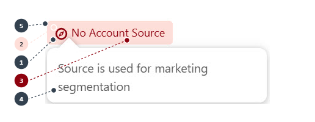

# Badge - Warning

{: width="460"}

## Field Values

|CMDT |No. |Field|Value|
|-----|---|------|-----|
|**Indicator Item** | 1 |**Inverse Icon Value**| `utility:guidance`|
|| 2 | **Inverse Icon/Badge Background** | `#feded8` |
|| 3 |**Inverse Icon Foreground** | `#8e030f` |
|| 4 |**Inverse Hover Text** | `Source is used for marketing segmentation`|
|| 5 |**Show when False or Blank** | `✓ shown because Account Source is False or blank`|