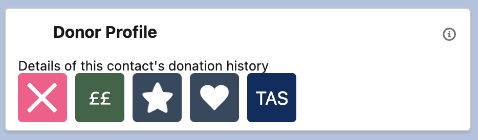

## Description

> This bundle of Indicators shows users key donation information about the contact.  It is designed to be used with NPSP.
Add this bundle to the Contact Lightning Page to display when Total Number of Donations >=1.

## Fields

| Fields | Value | 
|-----------|-----------|
|Label|`Contact Donor Profile`|
|Indicator Bundle Name|`Contact_Donor_Profile`
|Active|`true`
|sObject|`Contact`
|Card Title|`Donor Profile`
|Card Icon|`action:action:new_opportunity`
|Card Text|`Details of this contact's donation history`
|Description|`A Bundle to show on a Contact when using NPSP to show key donation information`

## Indicator Items

In the order they are displayed in the Bundle:
1. [Contact Household Total Gifts](contact-nonprofit.md#contact-household-total-gifts)
1. [Contact Total Gifts](contact-nonprofit.md#contact-total-gifts)
1. [Contact Donation Recency](contact-nonprofit.md#contact-donation-recency)
1. [Contact Donation Frequency](contact-nonprofit.md#contact-donation-frequency)
1. [Contact Regular Donor Status](contact-nonprofit.md#contact-regular-donor-status)
1. [Contact Membership Status](contact-nonprofit.md#contact-membership-status)

{: width="500"}

1. [Do Not Contact](contact-nonprofit.md#contact-do-not-contact)
1. [Contact Level](contact-nonprofit.md#contact-contact-level)
1. [One Off Donor](contact-nonprofit.md#contact-one-off-donor)
1. [Regular Donor](contact-nonprofit.md#contact-regular-donor)
1. [Seat Supporter](contact-nonprofit.md#contact-seat-supporter)

## Notes

* This is a nice use of the Action Icon in the Bundle. Unfortunately Action Icons can't be used in the Indicator Items, but they may be useful here. Just make sure your Bundles are consistent throughout your org. 
* This bundle uses fields from the NPSP. Ensure you have these fields in your org, and you are using them before creating an Indicator for the field.

## Contributed By
Vicky McLaren, [VickyMcL](https://github.com/VickyMcL){:target="_blank"}
Emma Keeling, [Salesforce_Em](https://github.com/Salesforce-Em){:target="_blank"}
