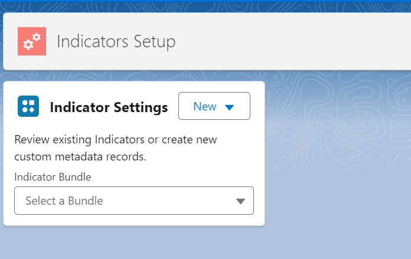

## Set Up Salesforce Indicators

See [Install Salesforce Indicators](../install-salesforce-indicators/) if you have not already installed Salesforce Indicators.

## 1. Design your Salesforce Indicators model

* Before creating your first **Indicator Bundle** or **Indicator Item** consider the data that will drive your indicators. 
* Consider your field design. Design field to be multi-use where ever possible.
* For example, you can create a formula field that returns a boolean value of true or false, or you can create a text field returning 3 or more short text results, which can both be used to display the correct indicators, plus also used in a report or list view to convey the same meaning.
* What is it that you want your users to know at-a-glance when they look at that record? Think about why this field matters, not just what the field value says. Indicators are not about just surfacing the field data to the top right hand corner of the page, but about providing meaning and value to your users.
* Creating indicators is an art, not a science, and you know your org better than we do, so we've made Indicators to be as flexible as possible, but start simply, then expand from there as your users crave more of the possibilities of what Indicators can do for them.   

{: .info-title}
>In Progress
>
>This needs to be built out further with the philosophy of using Indicators to help users. 

* Are you using [Declarative Lookup Rollup Summaries (DLRS)?](https://sfdo-community-sprints.github.io/DLRS-Documentation/){:target="_blank"} Consider whether DLRS could help you surface the data for the indicators you need.

## 2. Open the Indicators Setup tab
* Go to the *Indicators Setup* Tab

{: width="590"}

* Using the *Indicator Settings Component*

{: width="590"}

## 3. Set up your Indicator Bundle

* Use the *New* button to add a new [Indicator Bundle](indicator-bundle).

{: .tip-title}
>Stuck?
> 
>Staring down a blank screen with what you enter here? Never fear, just start with one of our Sample Indicators or Training Indicators to get a feel for what a Bundle or an Item looks like. Just **Select a Bundle** from the drop down list. 

## 4. Add to your Lightning Page

* Now you can add your Indicator Bundle to your [Lightning Page](add-to-lightning-page).
* It will have no items, but it's just to show you that you are on the right track.

## 5. Add your Indicator Item/s

* Use the *New* button to add a new [Indicator Item](indicator-item), and continue to add more Items.

## 6. Add your Indicator Bundle Item

* Use the *New* button to add a new [Indicator Bundle Item](indicator-bundle-item) to link the Bundle to the Item.

## 7. Review The Key

* Once published, review [The Key](the-key) and make any adjustments to improve the user experience.

## 8. Using Indicator Item Extensions

{: .tip-title}
>Start Slowly!
>
> Start using the Salesforce Indicator Bundles, Items and Item Bundles first before moving on to Indicator Item Extensions.
> Once you are comfortable with the basic Salesforce Indicator set up process, use the *New* button to add a new [Indicator Item Extension](item-extension) to an existing Item.

{: .note-title}
>Claude Notes
>
>- Step 1 ("Design your Salesforce Indicators model") is flagged in its own "In Progress" callout as needing the philosophy of using Indicators - this is one of at least three places on the site making the same request (see docs/about/structural-improvements.md #4). Once that content exists, this is a strong candidate to link to it rather than duplicate it.
>- This numbered 1-8 flow is reference-style ("do this, then this") but sits at the same level as the philosophy question in step 1 - splitting "why/what to plan" from "the 8 mechanical steps" (eg moving the planning question up into Getting Started, leaving this page purely procedural) would make this page faster to scan for someone on their second or third Bundle who just needs the steps.
>- This page, plus indicator-item/index.md and indicator-bundle.md, all separately explain "Go to the Indicators Setup tab" - see the new `_includes/open-indicator-setup.html` used on those pages; this page's numbered flow references the same action in step 2 and could adopt the same include for consistency.

