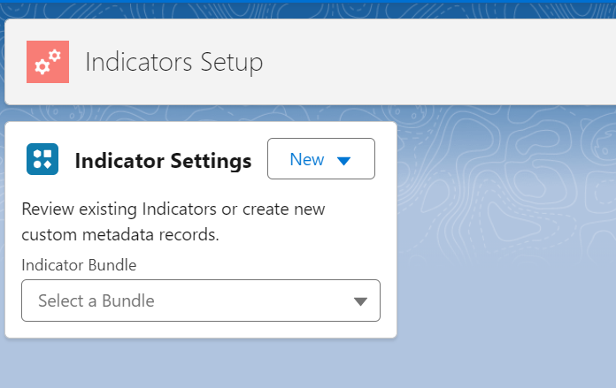

## Set Up Salesforce Indicators

See [Install Salesforce Indicators](../install-salesforce-indicators/) if you have not already installed Salesforce Indicators.

{: .tip}
>More to Come!
>
>Salesforce Indicators at the moment is one Component - the Indicator Bundle. The Indicator Bundle requires setting up via Salesforce Custom Metadata Records. 
>We are currently working on a new UI which will make setup of the Indicator Bundle much easier, but it is still a while away. 
>We also have two new [Components](../components) planned - the Grid and the Panel. 
>See [Getting Involved with Salesforce Indicators](../getting-involved/) if you would like to help us build out these exiting new features.

## 1. Design your Salesforce Indicators model

* Before creating your first **Indicator Bundle** or **Indicator Item** consider the data that will drive your indicators. 
* Below is a visual of the data model for each Component.

{: width="590"}

* Consider your field design. Design field to be multi-use where ever possible.

{: .info-title}
>In Progress
>
>This needs to be built out further describing the challenge of using boolean fields with other data, giving the example of memberships (is active) and months to end date

* Are you using [Declarative Lookup Rollup Summaries (DLRS)?](https://sfdo-community-sprints.github.io/DLRS-Documentation/) Consider whether DLRS could help you surface the data for the indicators you need.

## 2. Access the Salesforce Indicators setup Item
* Go to the *Indicators Setup* Tab

{: width="590"}

* Open the *Indicators Setup Menu*

{: width="590"}

## 3. Set up your Indicator Bundle

* Use the *New* button to add a new [Indicator Bundle](indicator-bundle).

## 4. Add to your Lightning Page

* Now you can add your Indicator Bundle to your [Lightning Page](add-to-lightning-page).
* It will have no items, but it's just to show you that you are on the right track.

## 5. Add your Indicator Item/s

* Use the *New* button to add a new [Indicator Item](indicator-item), and continue to add more Items.

## 6. Add your Indicator Bundle Item

* Use the *New* button to add a new [Indicator Bundle Item](indicator-bundle-item) to link the Bundle to the Item.

## 7. Review The Key

* Once published, review [The Key](the-key) and make any adjustments to improve the user experience.

## 8. Using Indicator Item Extensions

{: .tip}
>
> Start using the Salesforce Indicator Bundles, Items and Item Bundles first before moving on to Indicator Item Extensions.
> Once you are comfortable with the basic Salesforce Indicator set up process, use the *New* button to add a new [Indicator Item Extension](item-extension) to an existing Item.

