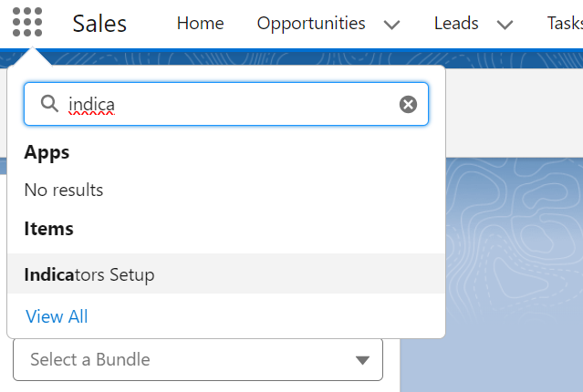

See [Install Salesforce Indicators](../../install-salesforce-indicators/) if you have not already installed Salesforce Indicators.

## Add a new Indicator Bundle
* Go to the *Indicators Setup* Tab

{: width="590"}

* Open the *Indicators Setup Menu*

{: width="590"}

## Edit an existing Indicator Bundle

* Go to the Tab *Indicators Setup* Tab: 
  * Choose the Indicator Bundle from the drop down list. The existing bundle details will be displayed
  * Click the *Edit Bundle* button

OR, alternatively

* Edit the Settings in CMDT:
  * Navigate to Salesforce *Setup* > *Custom Metadata Types*
  * Scroll to *Indicator Bundles* and click *Manage Records*
  * Click *Edit* next to the Bundle you want to edit

## Indicator Bundle Fields

|Field|Example Value|Description|Tip|
|---------|----------|-------------------|--------------------------|
|Label|`Account Bundle`||Include the Object Name in the Label
|Indicator Bundle Name|`Account_Bundle`|The API name|Make the API Name the same as the Label, but include underscores instead of spaces
|Card Title|`Account Inddicators`|Shows at top of card|
|sObject|`Account`|Choose the Object that this Bundle will be for|
|Card Icon|`standard:account`|The Icon name from [SLDS Icons](https://www.lightningdesignsystem.com/icons/){:target="_blank"}|Use default icons such as `standard:account`, `standard:opportunity`
|Card Text|`Key Indicators for Account`|The text to display below the Card Title
|Active|`true`||Uncheck Active if you need to quickly remove the Bundle from being visible on the page
|Description|`Shown on the Account page for standard Business Accounts`||Be an angel and write something useful here, _especially_ if you have more than one bundle for the same Object. Your future self will thank you

## Indicator Bundle Tips

**💡Setup Tips**

* When adding the Indicator Bundle to the Lightning Record Page, check the *Show Refresh Button* Checkbox. That way, as you are building your Indicators, you can quickly refresh the Bundle to see how the changes to the settings will appear on your page. 

**💡Design Tips**

* Titles and Icons are not required on Bundles, but they look best when the Large Icons are shown. a Bundle of small Icons used in a strip (see Examples) can look good with no Title and Icon. 
* If in doubt, just use the standard icon matching that record (eg `standard:account`)
* Don't use too many colors or icon styles. Try to stick with the [SLDS color pallette](https://www.lightningdesignsystem.com/design-tokens/){:target="_blank"}
* See [Additional Complementary Apps and Components to Enhance Your Org](../../other-apps)

## Next Steps

* Use the New button to add a new [Indicator Item](../indicator-item), and continue to add more Items
* Use the New button to add a new [Indicator Bundle Item](../indicator-bundle-item) to link the Bundle to the Item
* Add the Bundle to your [Lightning Page](../add-to-lightning-page) and check [The Key](../components/the-key)
* Optionally use the *New* button to add a new [Indicator Item Extension](../item-extension) to an existing Item
* Watch the 🎥 [Setup Video](https://www.youtube.com/watch?v=f76BGw0H2kg){:target="_blank"} for more details on how to setup Salesforce Indicators.

