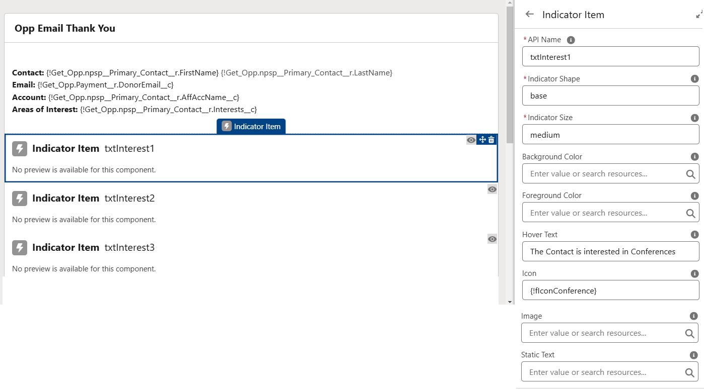
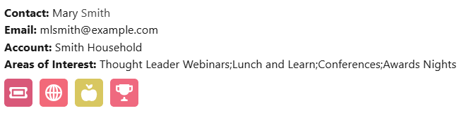

## Using Indicators in Screen Flow

New in [Version 0.4.0.8](../release-notes/index.md#0408) is the ability to create Indicators in Screen Flows. At this stage it is just a simple way to create individual Indicators, but it's on our [roadmap](https://github.com/SFDO-Community/Salesforce-Indicators/issues/99) to allow full Indicator Bundles to be visible in Screen Flows at a later date, so at the moment we are just dipping our toes in Screen Flow!

## Setup

* Add the Indicator Item component to the Flow Screen
* Enter the fields similarly to how you would set up the [Indicator Item](../setup-salesforce-indicators/indicator-item/index.md) in Custom Metadata Setup. 
* *API Name* - the Name for this component in the Flow
* *Indicator Shape* - enter `base` or `circle`
* *Indicator Size* - enter `medium` or `large`
* *Background Color* and *Foreground Color* - enter a value of a HTML Color (`blue`) or Hex Code (`#0000FF`). See [Icon Colors](../setup-salesforce-indicators/indicator-item/icon-colors.md) for tips.
* *Hover Text* - enter the text that will be displayed on hover. 
* *Icon* - enter the name of an SLDS Icon to display as the Indicator (eg `standard:account`). See See [Icon Tips](../setup-salesforce-indicators/indicator-item/icon-tips.md) for more details.
* *Image* - alternatively enter a full URL of an icon image to display. See notes on [Indicator Item](../setup-salesforce-indicators/indicator-item/index.md) for images and icons.
* *Static Text* - enter static text to be displayed instead of the SLDS Icon. The text will be displayed on the SLDS Icon's colored background. Eg entering `{!recordId}` for a Flow on and Account record will display `001`

{: width="590"}

## Example

This example is set up to show the Indicators that are displayed based on the values in the 'Areas of Interest' Multi Select Picklist field. 
{: width="590"}

## Things to Note

* The Full [Salesforce Indicators](../install-salesforce-indicators/index.md) package must be installed in your Org for the Indicator Item component to be visible in the Custom Components section in your Flow Screen. 
* You can use all the features of Flow, like Formulas, Text Templates, Variables etc to set the values in the Indicator Item component, so there are many cool things that you can do with this Component. 
* It's best to put the Indicator Item components in a Section, or the Indicator will display in-line with the text below - but for a single Indicator on the Screen Flow, that could look great. 
* Always set up conditional visibility to not display the Indicator Item Component if no Indicator will be displayed based on the record value. 
* Also set up the conditional visibility of the Section so the Section will not display if no Indicators will be visible based on the record value. 