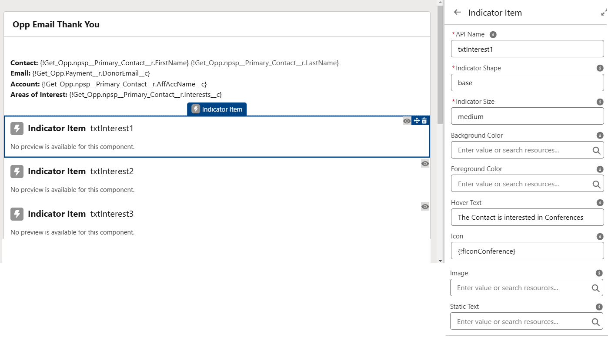
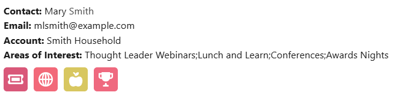

## Using Indicators in Screen Flow

New in [Version 0.4.0.8](../release-notes/index.md) is the ability to create Indicators in Screen Flows. ~~At this stage it is just a simple way to create individual Indicators, but it's on our [roadmap](https://github.com/SFDO-Community/Salesforce-Indicators/issues/99) to allow full Indicator Bundles to be visible in Screen Flows at a later date, so at the moment we are just dipping our toes in Screen Flow!~~

{: .new-title}
>NEW! Indicator Bundle in Flow
>
>The full [Indicator Bundle](../setup-salesforce-indicators/indicator-bundle.md) is now available as a Flow component too - see [Indicator Bundle in Flow](#indicator-bundle-in-flow) below. The single Indicator Item component (below) is still available for when you just want one configurable Indicator on a Flow Screen.

## Indicator Bundle in Flow

Drop the **Indicator Bundle** component onto your Flow Screen and it displays exactly as it would on a Record Page, using the Avatar style.

* Choose the **Indicator Bundle** to display - you can use an existing Bundle, or create one specifically for this Flow.
* Enter the **Record Id** property - use a Flow variable holding the Id of the record the Bundle should display Indicators for (eg `{!recordId}` on a Record-Triggered Flow, or a variable you've populated earlier in the Flow).
* The other display properties (Title, Description, Size, Shape) work the same as [Add the Bundle to the Lightning Page](../add-to-lightning-page).

{: .info-title}
>In Progress
>
>Add screen shots and an example of the Indicator Bundle component set up in a Flow.

## Single Indicator Item in Flow

For a completely configurable single Indicator (rather than a full Bundle), use the **Indicator Item** Flow component below.

## Setup

* Add the Indicator Item component to the Flow Screen
* Enter the fields similarly to how you would set up the [Indicator Item](../setup-salesforce-indicators/indicator-item/index.md) in Custom Metadata Setup. 
* *API Name* - the Name for this component in the Flow
* *Indicator Shape* - enter `base` or `circle`
* *Indicator Size* - enter `medium` or `large`
* *Background Color* and *Foreground Color* - enter a value of a HTML Color (`blue`) or Hex Code (`#0000FF`). See [Icon Colors](../setup-salesforce-indicators/indicator-item/icon-colors.md) for tips.
* *Hover Text* - enter the text that will be displayed on hover. 
* *Icon* - enter the name of an SLDS Icon to display as the Indicator (eg `standard:account`). See See [Icon Tips](../setup-salesforce-indicators/indicator-item/icon-tips.md) for more details.
* *Image* - alternatively enter a full URL of an icon image to display. See notes on [Indicator Item](../setup-salesforce-indicators/indicator-item/index.md) for images and icons.
* *Static Text* - enter static text to be displayed instead of the SLDS Icon. The text will be displayed on the SLDS Icon's colored background. Eg entering `{!recordId}` for a Flow on and Account record will display `001`

{: width="590"}

## Example

This example is set up to show the Indicators that are displayed based on the values in the 'Areas of Interest' Multi Select Picklist field. 
{: width="590"}

## Things to Note

* You can use all the features of Flow, like Formulas, Text Templates, Variables etc to set the values in the Indicator Item component, so there are many cool things that you can do with this Component. 
* It's best to put the Indicator Item components in a Section, or the Indicator will display in-line with the text below - but for a single Indicator on the Screen Flow, that could look great. 
* Always set up conditional visibility to not display the Indicator Item Component if no Indicator will be displayed based on the record value. 
* Also set up the conditional visibility of the Section so the Section will not display if no Indicators will be visible based on the record value. 

{: .info-title}
>In Progress
>
>Add more screen shots and tips for using Indicators in Flow.

{: .note-title}
>Claude Notes
>
>- A strikethrough sentence survives in the intro ("At this stage it is just a simple way to create individual Indicators...") describing a limitation that's since been resolved (per the NEW callout right after it) - strikethrough-but-left-in-place reads as a mid-edit artifact rather than a deliberate style choice; recommend deleting the struck-through sentence entirely now that the NEW callout supersedes it.
>- "Things to Note" (conditional visibility reminders) is good, specific Flow-building advice that a Flow-experienced but Indicators-new admin would want up front, not buried at the bottom - consider moving it above the numbered Setup section.
