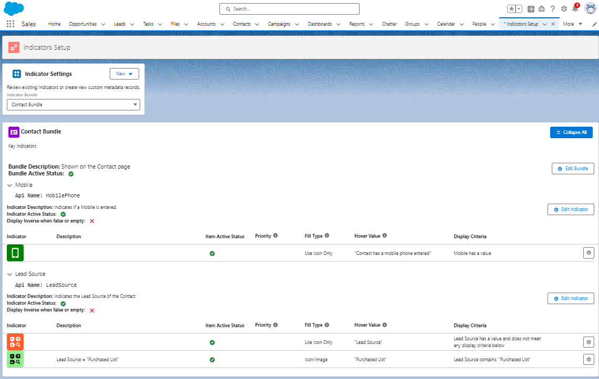

## Overview of the Key

The Key is a multi purpose component that has three main uses: 
* As a key to the Indicators that have been set up and are active on the page. Users can click the i icon to show the Key to get more information on why an Indicator is showing, or not showing. 
* As a quick link to the Indicator Setup for Admins. If you have the Indicator Setup Permission Set, then The Key is expanded to show setup icons. Clicking the Setup icons will take you directly to the CMDT record to modify the Bundle or Item. 
* As an overall setup page. If you have the Indicator Setup Permission Set, then the Indicators Tab is available and All Indicators will be visible from that tab, with direct links to create and edit the CMDT. 

{: .new-title}
>NEW! Refresh Button
>
>The Key now has a **Refresh Button**. This is handy for Admins making changes to a Bundle's setup - click it to refresh just that Bundle, without needing to refresh the whole page.

{: .info-title}
>In Progress
>
>This needs to be built out further to describe how to modify the key details to provide the best user experience

### An Example Screen
_This example show a Bundle with two Indicator Items. The first is a simple item. The second is an item with one extension._

{: .note-title}
>Claude Notes
>
>- This page's own "In Progress" callout asks for guidance on "how to modify the key details to provide the best user experience" - that's squarely an opinionated/Philosophy-page question (see docs/about/structural-improvements.md #4), not a reference question, and is a good candidate to answer there and link back from here.
>- The Key is described as having three distinct jobs (legend for users, setup shortcut for Admins, full setup tab) in one short paragraph - each of those three could arguably be its own subheading with its own short example, since they're genuinely different audiences (end user vs. Admin) reading the same page.
>- Both new recipes' Bundles (Case, Opportunity) would make good "Example Screen" candidates here once real Bundles exist to screenshot, beyond the current single generic two-item example.

