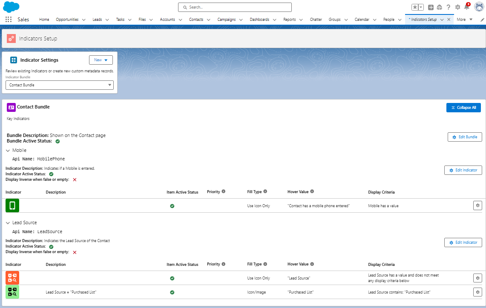



## Overview of the Key

The Key is a multi purpose component that has three main uses: 
1. As a key to the Indicators that have been set up and are active on the page. Users can click the i icon to show the Key to get more information on why an Indicator is showing, or not showing. 
1. As a quick link to the Indicator Setup for Admins. If you have the *Indicators Setup Access* Permission Set, then The Key is expanded to show setup icons. Clicking the setup icons will take you directly to the CMDT record to modify the Bundle or Item. 
1. As an overall setup page. If you have the *Indicators Setup Access* Permission Set, then the Indicators Tab is available and all Bundles and their Indicators will be visible from that tab, with direct links to create and edit the CMDT. 

{: .new-title}
>🆕Refresh Button
>
>The Key now has a **Refresh Button**. This is handy for Admins making changes to a Bundle's setup - click it to refresh just that Bundle, without needing to refresh the whole page.

{: .new-title}
>🆕Preview, Download, and Upload Bundles and Indicators to your org
>
>An exciting new feature is now available on the **Indicators Setup** tab. You can now Preview an Indicator or Bundle shared from this site or shared by another Admin, plus you can download your Indicators to share to others, and upload Indicators to your org. 
>See [Preview and Share Recipes](../recipes/share.md) for more details!

### An Example Screen

This example show a Bundle with two Indicator Items. The first is a simple item. The second is an item with one extension.

## Related Pages

* See [Building Glanceable Indicators](../best-practices/index.md) for more tips and tricks on using The Key.  

