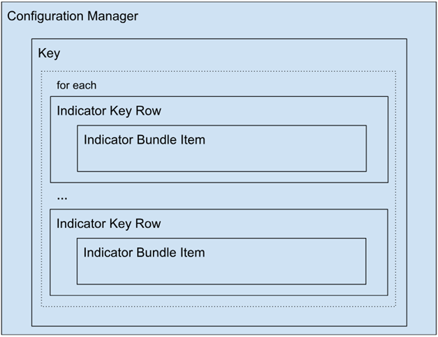
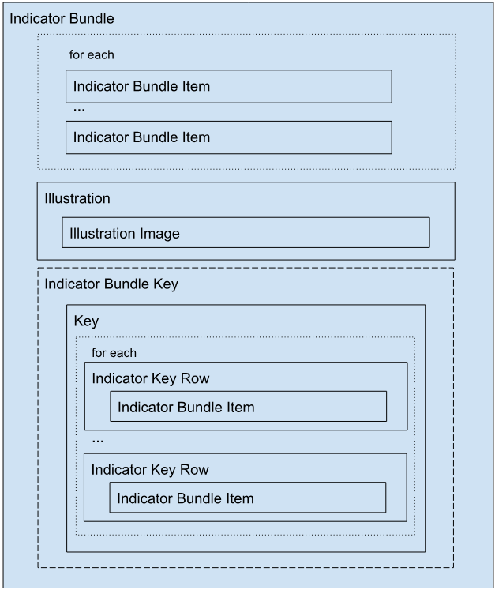

  

    Page contents
  

  {: .text-delta }
- TOC
{:toc}



# Lightning Web Components
{: .no_toc }

The components users see and interact with. For the data they display, see [Data Model](data-model.md); for the Apex that feeds them, see [Apex Classes](apex-classes.md).

## Custom Permission

To help manage access, a custom permission was set up and is used inside of the LWCs to grant additional access to users with the Manage Indicator Key permission.

## Illustration

An image and inline text that work in tandem to communicate a state in a more friendly way. Use within other components, such as cards, to express the state of the component.

## Illustration Image

The image portion of the Illustration component. Expands to fill the width of its container.

## Indicator Bundle

Displays at-a-glance visual representations of status, values, and key details about a record. Utilizes the Illustration component to display more information.

## Configuration Manager

Displays a picklist of all Bundles and renders the respective Key component upon selection.

## Key

The details portion of the Indicator Bundle Key and Configuration Manager components.

## Indicator Key Row

The row portion for each Indicator Item or Indicator Item Extension within the Key component.

## Indicator Bundle Key

The modal used to display the Key component associated with the Indicator Bundle component.

## Indicator Bundle Item

The image/avatar depicting a field value used by the Indicator Bundle and the Indicator Key Row components. 

{: width="590"}
{: width="590"}

**Contributed by** [Tim Schug](https://github.com/tschug)

